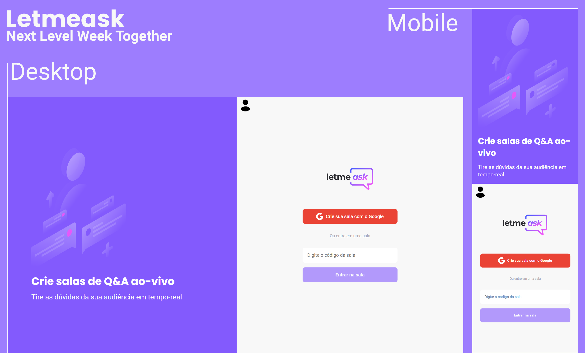

  

<h1 align="center">
    
</h1>

Projeto realizado acompanhando a nlw togther (6ª edição) da [Rocketseat](https://www.rocketseat.com.br/).

Link para a aplicação: [Letmeask](https://letmeask-ac1604.web.app/).

## 🧪 Tecnologias

Esse projeto foi desenvolvido com as seguintes tecnologias:

- [React](https://reactjs.org)
- [Firebase](https://firebase.google.com/)
- [TypeScript](https://www.typescriptlang.org/)

## 💻 Projeto

Letmeask é perfeito para criadores de conteúdos poderem criar salas de Q&A com o seu público, de uma forma muito organizada e democrática. 

Este é um projeto desenvolvido durante a **[Next Level Week Together](https://nextlevelweek.com/)**, apresentada dos dias 20 a 27 de Junho de 2021.

## 🚀 Melhorias

- Responsivo;
- Verificações de segurança;
- Logout de usuário;
- Ajustes no CSS e HTML (a meu gosto).

## 🔖 Layout

Você pode visualizar o layout do projeto através do link abaixo:

- [Layout Web](https://www.figma.com/community/file/1009824839797878169) 

Lembrando que você precisa ter uma conta no [Figma](http://figma.com/).